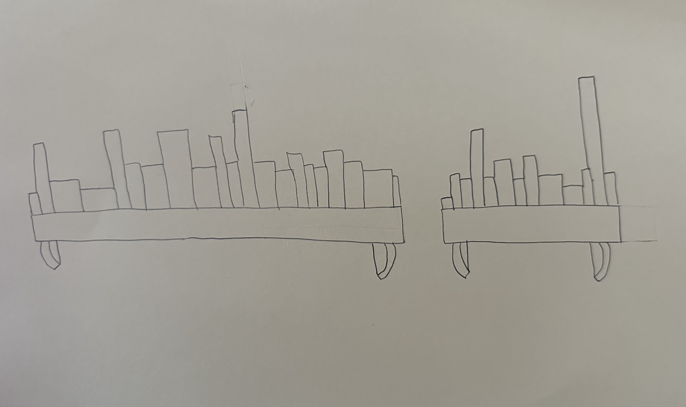
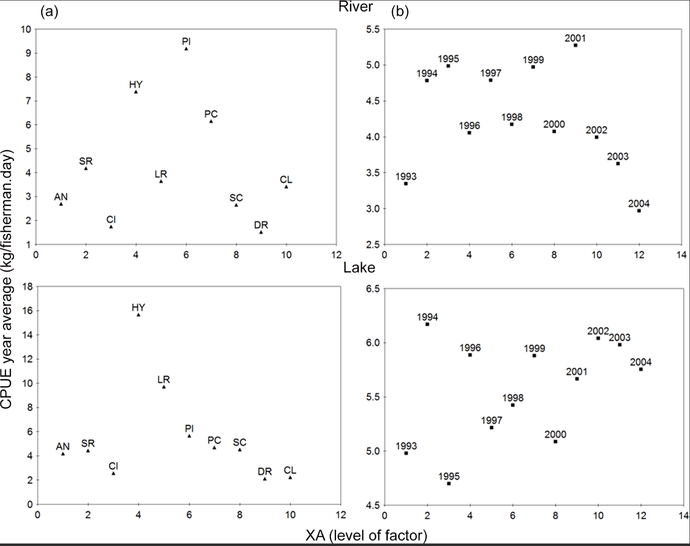

## Github repository: https://github.com/spardehpoosh/ENVS-193DS_homework-03.git

# Set up

```{r}
#| label: reading in packages and data
#| message: false

library(tidyverse) # general use
library(janitor) # cleaning data frames
library(here) # file/folder organization
library(readxl) # reading .xlsx files

# reading in data
salinity <- read_csv(here("data", "salinity-pickleweed.csv")) # storing salinity pickleweed data as an object called salinity
reading_data <- read_csv(here("data", "personal_data.csv")) # storing personal data as an object called reading_data
```


# Problem 1. Slough soil salinity

## a. An apropriate test

To test the strength of the relationship between salinity and California pickleweed biomass, I would use Pearson's correlation or Spearman's Rank. Pearsons' correlation is the parametric version to measure the strength of a linear relationship. In contrast, Spearman rank correlation is the non-parametric version and tests for a monotonic relationship based on ranks between variables. Pearson's correlation requires an approximately normal distribution and continous variables while Spearman's rank does not have these requirements. 

## b. Create visualization 

```{r}
#| label: salinity scatterplot
#| message: false

# base layer: ggplot
ggplot(data = salinity, # using salinity data set for plot
       aes(x = salinity_mS_cm, # x-axis predictor - soil salinity
           y = pickleweed)) + # y-axis response - California pickleweed biomass
  geom_point(size = 2, # changing size of individual points
             color = "firebrick4") + # changing color of individual points
  labs(x = "Soil Salinity (mS/cm)", 
       y = "California pickleweed biomass (g)",
       title = "As soil salinity (mS/cm) increases, 
       California pickleweed biomass (g) increases") + # adding title
  theme_minimal() # changing theme from ggplot default
```


## c. Check assumptions and run the test

### Check assumptions for Pearson's correlation

#### Continous Variables
Both variables are assumed to be continuous by study design. 

#### Linear relationship between variables
Based on the scatterplot in part 1b, there seems to be a linear relationship between soil salinity (mS/cm) and California pickleweed biomass (g). 

#### Normality
```{r}
#| label: qqplot for pickleweed biomass
#base layer: ggplot
ggplot(data = salinity, # starting with the clean lobsters data frame
       aes(sample = salinity_mS_cm, # y-axis for gg plot
           )) + 
  geom_qq_line(color = "maroon4") + # reference line in maroon
  geom_qq() + # points on qqplot
  labs(title = "qq plot to assess normality of pickleweed biomass data") + # adding title for qq plot
  theme(legend.position = "none") # removing the legend
```

```{r}
#| label: qqplot for pickleweed
#base layer: ggplot
ggplot(data = salinity, # starting with the clean lobsters data frame
       aes(sample = pickleweed, # y-axis for gg plot
           )) + 
  geom_qq_line(color = "maroon4") + # reference line in maroon
  geom_qq() + # points on qqplot
  labs(title = "qq plot to assess normality of salinity data") + # adding title for qq plot
  theme(legend.position = "none") # removing the legend
```
Looking at the qqplots, it seems as soil salinity and pickle weed biomass are approximately normally distributed because the points on both QQplot follow the straight line, especially in the middle of the line

### Run the test

```{r}
#| label: running the test

cor.test(salinity$salinity_mS_cm, salinity$pickleweed, method = "pearson") # Pearson's test for strength of relationship between salinity and pickleweed biomass

```

## d. Results communication 

To evaluate the strength of the relationship between pickleweed biomass (g) and soil salinity (mS/cm), I used a Pearson's correlation because the scatter plot showed linear relationship between the two variables, the qqplots showed approximately normal distributions, and both variables were continuous. We found a moderate relationship between soil salinity and pickleweed biomass (Pearson's r = 0.53, t(21) = 2.9, p = 0.009, $\alpha$ = 0.05)

## e. Test implications

The pearson's correlation test showed a moderate positive relationship between soil salinity and pickleweed biomass indicating as salinity levels increase, so does picklweed biomass. To optimize pickleweed planting success in the future, I recommend finding the optimal range of salinity for pickleweed growth.

## f. Double check your work

I chose Pearsons's correlation as the data fit the assumptions, but it would also be possible to use Spearman's rank. 

```{r}
#| label: spearman's test

cor.test(salinity$salinity_mS_cm, salinity$pickleweed, method = "spearman") # Spearman's test for strength of relationship between salinity and pickleweed biomass
```
Using Spearman's rank, we also found a moderate relationship between soil salinity and pickleweed biomass (Spearman's $\rho$ = 0.59, S = 824, P = 0.003, $\alpha$ = 0.05). 
Both tests would would lead us to reject the null hypothesis that there is no relationship between soil salinity and pickleweed biomass, and rather both show that there is a moderate relationship between these two variables. Pearson's correlation (r = 0.53, p = 0.009) and Spearman's rank ($\rho$ = 0.58, p = 0.003), both produced p-values below our significance level $\alpha$ = 0.05 so the null hypothesis would be rejected. While Pearson's correlation assesed the linear relationship and spearman's rank assesed the monotmic relationship based on ranks, they both indicate that as soil salinity increases, so does pickleweed biomass. 

# Problem 2. Personal data 

## a. Updating your visualizations 

### Cleaning data
```{r}
#| label: cleaning data

reading_data_clean <- reading_data |> # starting with original reading data frame
  clean_names() # cleaning the column names so only lower case letters and underscores are used
  
```

#### Visualization of school day (categorical predictor variable) vs reading duration (response variable)
```{r}
#| label: School day vs reading duration


# base layer: ggplot
ggplot(data = reading_data_clean, # starting with my data clean
       aes(x = school_day, # school day on x axis
           y = duration_minutes, # reading duration in minutes on y axis
           color = school_day
       )) +
  geom_boxplot() + # second layer: boxplot
  geom_jitter(height = 0, # adding horizontal jitter
              width = 0.3) + 
   scale_color_manual(
    values = c("No" = "seagreen4", # coloring box and points for non school days in sea green
               "Yes" = "lightpink2") # coloring box and points for yes school days in light pink
  ) + 
  labs(
    x = "School Day", # relabelling x-axis
    y = "Reading Duration (minutes)", # relabelling y-axis
    title = "There is no obvious difference in reading 
    duration on school days vs non school days")+
  theme_minimal() + # changing the gg plot theme
  theme(legend.position = "none") # removing the legend 
```


#### Visualization of start time (continuous predictor variable) vs reading duration (response variable)
```{r}
#| label: Temperature vs reading duration

# base layer: ggplot
ggplot(data = reading_data_clean, # starting with my data clean
       aes(x = start_time, # average daily temperature on the x axis
           y = duration_minutes)) +  # reading duration on the y axis
  geom_point(color = "firebrick4") + # changing the color of the points
  labs(
    x = "Time when reading started", # changing x-axis label
    y = "Reading Duration (minutes)", # changing y-axis label
    title = "Earlier start times led to longer reading duration" # creating a title for my plot
  ) +
  theme_minimal() # changing the ggplot theme to dark
```


## b. Captions

**Figure 1: There is no obvious difference in central tendancies of reading duration on school days vs non school days.** Median line is shown for the reading duration on non school days (green) and school days (pink). Upper and lower quartiles are shown above and below the median respectivley. Points represent individual observations of reading duration on non school days (green) and school days (pink). Source: personal data collected by me, Sophie Pardehpoosh

**Figure 2: Reading duration was longer when start time was earlier in the day.** Red points represent individual observations of reading duration vs the time that reading began. Source: personal data collected by me, Sophie Pardehpoosh

# Problem 3. Affective visualization 

## a. Description of visualization

I am planning on drawing a bookshelf with one book for each observation I took. The height of the book will represent the reading duration for that observation, the width will represent number of assignments, and the color will represent the book/author combination of the book from that observation. The shelf will be split into two parts, one for school day, and the other for non-school day.

## b. Sketch of visualization



## c. Draft of visualization 


## d. Artist statement

I am showing how much I read (in minutes) on school days vs non school days, which book I'm reading, and how many assignments I am working on that day. I found digital art influenctial for my affective visualization. I have noticed a rise in visual media recently, and wanted to try this to display my personal data. My visualization is drawn and assembled on my tablet with Procreate and Canva. I created this work by drafting components on procreate, and putting them together on canva. Height and width of books were determined using a graph that was removed after. 

## e. Prep materials to share in class
[Google Slides Presentation](https://docs.google.com/presentation/d/1AlU0lExzSd3VYh3XV0Vthh39OBI9zX_CdPrE-ke39aQ/edit?usp=sharing)

# Problem 4. Statistical critique

## a. Revisit and summarize

ANOVA or analysis of variance was applied to test the variance in monthly average catch per unit effort (CPUE) according to the taxonomic family of the most abundant fish species in the Lower Amazon region. The predictor variables were the taxonomic families, the fisheries region, the months and years of the fisheries while the response variable was catch per unit effort (CPUE) which represents fishery productivity. 



## b. Visual clarity

This figure illustrates the results from the ANOVA tests. The y-axis shows yearly mean catch per unit effort (CPUE). The x-axes is called the "level of factor" where each number represents a different classification of the categorical variables, including taxanomic families and years. The top graphs show rivers, and the bottom show lakes. Panel (a) are for different species, while panel (b) are for different years. This makes sense since the response variable (CPUE) is on the y-axis, and the 4 graphs show different combinations of predictor variables on the y-axis. 

## c. Aesthetic clarity

The authors did a good job at handling visual clutter. The data to ink ratio is appropriate as they took out the grid lines and just kept the tick marks along the axes. Since there are different panels for each predictor variable, there is not need for different colors or other elements which they did not include. 

## d. Recommendations

I would change the label of the y-axis, "XA (level of factor)" because it is not obvious what that means. I would also label that for panel (a), the factor is species while for panel (b) the level is year. I would also consider including summary statistics, likes means with error bars or confidence intervals, but I believe this could add visual clutter and cause a high data to ink ratio. 


